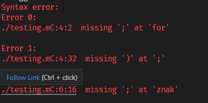

# Runable executables of interpreter availeble in [releases](https://github.com/TheRWe/PRKL/releases)

# USAGE ARGUMENTS
`exec` is shortuct executable of interpreter (in `./build/` or downloaded from [releses](https://github.com/TheRWe/PRKL/releases))

 - `-h` show help
 - `exec InputFile [OutputFile]`
   - `InputFile` *.mC* or *.json* file
   - `OutputFile` (optional) if input is *.mC* file then in json output file will be saved compiled json internal represenantaion.
 - Other arguments 
    - `-f` force overwrite file when output (json) specified
    - `-i` run interpreter (no need when no output file specified)

## EXAMPLES
`exec` is shortucut for executable of interpret 
 - `exec test.mC` compile and intepret `test.mC` file
 - `exec test.mC output.json` save compiled program into `output.json`
 - `exec test.mC output.json -i` save compiled program into `output.json` and run interpreter
 - `exec output.json` interpret compiled file

## Errors

When .mC file contains syntax error, compilation is aborted and all error is outputed into console. (in IDE error have clickable links)

Running `.json` file can result in `Error reading json file`. All json file has to satisfy `mCTree.schema.json` schema to be runable by interpreter.

## BUILDING
 0) have [nodejs](https://nodejs.org/) installed 
 0) build parser from mC.g4 (or download parser in [releases](https://github.com/TheRWe/PRKL/releases))
    - download and instal [antlr](https://www.antlr.org/)
    - build javascript parser into `./parser/` file
 0) run `npm run build-full` script
 0) builded executables is in `./build/` dir

